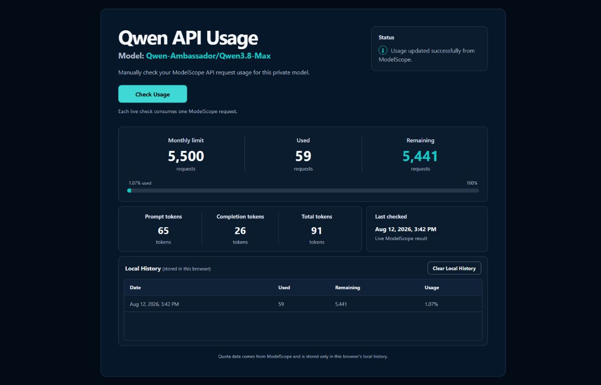

<div align="center">

# ◈ Qwen Ambassador Usage Checker

### A private, manual dashboard for the live ModelScope request quota

`Qwen-Ambassador/Qwen3.8-Max` · `Node.js 22+` · `zero npm dependencies`

<a href="https://replit.com/github.com/dglabsxyz/qwen-ambassador-usage-checker">
  
</a>

</div>



## What it tells you

ModelScope describes API-Inference as having a dynamically adjusted daily free quota, but its Qwen Ambassador inference response currently exposes a **monthly request allowance**. This dashboard turns the confirmed response headers into a clear manual reading:

| Metric | Meaning |
|---|---|
| **Monthly limit** | Requests allocated to the model for the current month |
| **Used** | `limit − remaining` |
| **Remaining** | Requests still available in the current monthly allocation |
| **Probe tokens** | Tokens consumed by the one-token measurement request |

The app reads:

```text
modelscope-ratelimit-model-month-requests-limit
modelscope-ratelimit-model-month-requests-remaining
```

It does not invent a daily limit that ModelScope does not return.

## Security by design

- The ModelScope credential exists only in the server environment as `MODELSCOPE_TOKEN`.
- The credential never enters HTML, browser JavaScript, `localStorage`, responses, screenshots, or logs.
- Static assets and health checks never contact ModelScope.
- Only a manual **Check Usage** action can start a quota probe.
- Successful probes are cached for exactly 60 seconds, preventing repeated clicks from consuming extra requests.
- Concurrent clicks share one in-flight probe.
- Upstream errors are converted to stable public messages with no response-body or authorization leakage.
- A repository verifier rejects tracked environment files and credential-shaped content before publication.
- The production app is intended to remain private even though this source repository is public.

> [!IMPORTANT]
> Never commit a ModelScope token. Replit does not import secret values from GitHub; add the token only through **Tools → Secrets** after importing the repository.

## Run on Replit

Press the button above to import this public repository into Replit, or open the [Replit import URL](https://replit.com/github.com/dglabsxyz/qwen-ambassador-usage-checker).

After import:

1. Run `npm test` and `npm run verify:repo` in Replit Shell.
2. Open **Tools → Secrets**.
3. Add the key `MODELSCOPE_TOKEN` and its value.
4. Press **Run** and confirm the page opens without making a quota request.
5. Press **Check Usage** once.
6. Publish with **Autoscale**, the lowest suitable machine size, and **Maximum machines: 1**.
7. Restrict deployment access to **Only you**.
8. Configure the strictest available budget or usage limit for your Core account.

Every uncached check consumes one ModelScope inference request. Page loads, refreshes, health checks, and requests served from the 60-second cache consume none.

## Local development

Requirements:

- Node.js 22 or newer
- A ModelScope token with access to `Qwen-Ambassador/Qwen3.8-Max`

Set `MODELSCOPE_TOKEN` through your operating system's process-level secret workflow. Do not put it in a project file.

```text
npm test
npm run verify:repo
npm start
```

Open `http://localhost:3000`. Clear the process environment variable after local use.

## Architecture

```text
Browser
  └─ POST /api/quota (manual action only)
       └─ 60-second in-memory cache
            └─ minimal ModelScope chat-completions probe
                 └─ monthly quota headers → normalized JSON
```

The browser stores only validated quota history under `qwen-quota-history-v1`. No database, scheduled worker, WebSocket, analytics package, remote font, or frontend framework is used.

## Verification

```text
npm test
npm run verify:repo
```

To inspect an HTTPS deployment without consuming a ModelScope request, set `DEPLOYMENT_URL` for the current process and run:

```text
npm run verify:deployment
```

The deployment verifier performs only `GET` requests unless `ALLOW_LIVE_PROBE=1` is explicitly enabled.

## Operations

See [docs/operations.md](docs/operations.md) for token rotation, private-access verification, Autoscale controls, budget protection, safe log review, and maintenance.

## Share safely

The code is designed to be shared publicly. Each person deploying it must supply their own ModelScope token privately. Before publishing a fork or accepting changes, rerun the tests and repository verifier and inspect the complete Git history for credential-shaped content.

---

<div align="center">

Built for deliberate, low-cost checks—not background polling.

</div>
